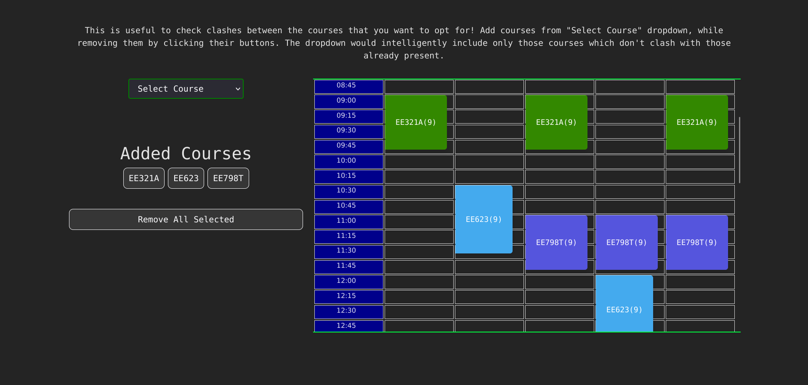

# Academic-flexibility Scheduler IITK

This is a project meant to help students choose their courses in a more easier fashion.

The major constraint on choosing courses are:

- Courses must belong to the current semester
- Chosen courses must not clash according to the timetable

## TODO

- module that takes in a set of courses with their timings and the amount of credits needed, and returns those sets which are compatible with each other. this module should be able to take some predefined/inserted courses and adjust according to that. It would not consider which type of courses are there, aka neglect any department or type of course.

- create a UI that allows you to add or subtract interested courses, by providing from a pool. The pool should be served.

- Create the PDF parsing system to generate the JSON file

- <https://stackoverflow.com/questions/75980179/how-can-i-serve-a-react-app-from-flask-backend>

## Known Issues

- Currently I am ignoring that practical courses occupy multiple days a week even though may actually take up only one. Therefore any course that clashes with any of the practical slots will still be considered a clash.
- During re-rendering upon page-reload, a random card gets added during the second phase of strict mode. This actually is not present in the server and therefore not taken into account as a legit course. Please clear all courses before starting to scheduler until the bug gets fixed.

## Solved Issues

- During development, aka in React Strict Mode, every request within render happens twice, this leads to interference of the first request processing, due to effects similar to state machines, therefore use blocking locks

## Future work

Possible functionalities:

- The courses you select provides a prior to what kind of courses you would want to take up, which should be recommended first. Make the selection bar more intelligent.

## References

- [Locking to prevent multiple simultaneous requests changing state](https://stackoverflow.com/questions/43999611/flask-suspend-other-requests-while-a-certain-one-is-being-handled)
- [Strict Mode React](https://stackoverflow.com/questions/68914256/react-request-to-api-trigger-two-times-the-then-block-the-request-is-sended-tw)
