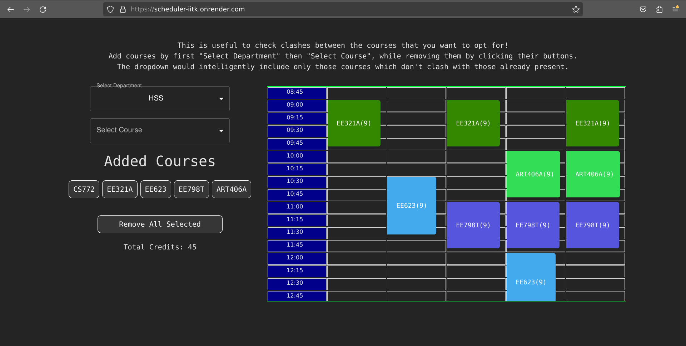

# Academic-flexibility Scheduler IITK

This is a project meant to help students choose their courses in a more easier fashion.  
Find it at [scheduler-iitk.onrender.com](https://scheduler-iitk.onrender.com/)

The major constraint on choosing courses are:

- Courses must belong to the current semester
- Chosen courses must not clash according to the timetable

## Known Issues

- Currently I am ignoring that practical courses occupy multiple days a week even though may actually take up only one. Therefore any course that clashes with any of the practical slots will still be considered a clash.
- During re-rendering upon page-reload, a random card gets added during the second phase of strict mode. This actually is not present in the server and therefore not taken into account as a legit course. Please clear all courses before starting to scheduler until the bug gets fixed.
- The codebase is not memory optimized, which leads to delays for every usage due to free hosting service used.

## Solved Issues

- During development, aka in React Strict Mode, every request within render happens twice, this leads to interference of the first request processing, due to effects similar to state machines, therefore use blocking locks
- Included session-management to make all users independent of each other, and have a session last for a user even after closing the request, as cookies.

## Future work

- The courses you select provides a prior to what kind of courses you would want to take up, which should be recommended first. Make the selection bar more intelligent.
- The courses should be distributed according to departments, which should be another dropdown chosen before the course itself.

## References

- [Locking to prevent multiple simultaneous requests changing state](https://stackoverflow.com/questions/43999611/flask-suspend-other-requests-while-a-certain-one-is-being-handled)
- [Strict Mode React](https://stackoverflow.com/questions/68914256/react-request-to-api-trigger-two-times-the-then-block-the-request-is-sended-tw)
